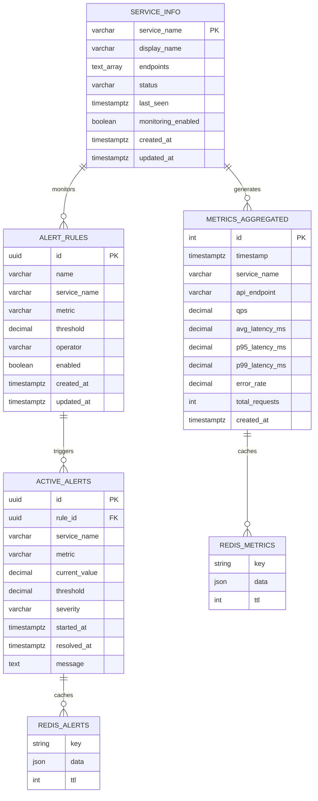

# 數據庫架構設計文檔

## 📋 概覽

本文檔詳細說明 Model API 監控系統的完整數據結構設計，包括 PostgreSQL 表結構、Redis 快取層，以及每個 API 端點對應的數據庫關係。

### 架構統計
- **PostgreSQL 表**: 4 個主要表
- **Redis 快取模式**: 3 種快取策略  
- **API 端點**: 21 個
- **數據保留期**: 30 天自動清理
- **預估數據量**: 百萬級時序記錄

## 🗃️ PostgreSQL 數據庫結構

### 表結構總覽

| 表名 | 類型 | 主要用途 | 記錄數量 (估計) | 保留期 |
|------|------|----------|----------------|--------|
| `metrics_aggregated` | 時序表 (TimescaleDB) | 聚合指標存儲 | 百萬級 | 30天 |
| `alert_rules` | 配置表 | 告警規則定義 | 數十條 | 永久 |
| `active_alerts` | 狀態表 | 活躍告警記錄 | 數百條 | 解決後保留7天 |
| `service_info` | 主數據表 | 服務基本信息 | 數十條 | 永久 |

### 1. metrics_aggregated (聚合指標表)

**表類型**: TimescaleDB 時序表  
**主要索引**: timestamp (時間分區)  
**數據保留**: 30 天自動清理  
**壓縮策略**: 7 天後自動壓縮

| 欄位名 | 數據類型 | 約束 | 描述 | 範例值 |
|--------|----------|------|------|--------|
| `id` | `SERIAL` | `PRIMARY KEY` | 自增主鍵 | 123456 |
| `timestamp` | `TIMESTAMPTZ` | `NOT NULL` | 指標時間戳 | 2025-07-01T10:30:00Z |
| `service_name` | `VARCHAR(100)` | `NOT NULL` | 服務名稱 | "model-api-v1" |
| `api_endpoint` | `VARCHAR(200)` | `NOT NULL` | API 端點 | "/predict" |
| `qps` | `DECIMAL(10,2)` | `DEFAULT 0` | 每秒查詢數 | 2.50 |
| `avg_latency_ms` | `DECIMAL(10,2)` | `DEFAULT 0` | 平均響應時間 | 120.50 |
| `p95_latency_ms` | `DECIMAL(10,2)` | `DEFAULT 0` | P95 響應時間 | 180.20 |
| `p99_latency_ms` | `DECIMAL(10,2)` | `DEFAULT 0` | P99 響應時間 | 250.80 |
| `error_rate` | `DECIMAL(5,4)` | `DEFAULT 0` | 錯誤率 (0-1) | 0.0200 |
| `total_requests` | `INTEGER` | `DEFAULT 0` | 總請求數 | 1500 |
| `created_at` | `TIMESTAMPTZ` | `DEFAULT NOW()` | 記錄創建時間 | 2025-07-01T10:30:05Z |

**索引結構**:
```sql
-- 主要索引 (TimescaleDB 自動創建)
CREATE INDEX ON metrics_aggregated (timestamp DESC);

-- 查詢優化索引
CREATE INDEX idx_metrics_service_time ON metrics_aggregated (service_name, timestamp DESC);
CREATE INDEX idx_metrics_endpoint_time ON metrics_aggregated (api_endpoint, timestamp DESC);
CREATE INDEX idx_metrics_created_at ON metrics_aggregated (created_at DESC);
```

### 2. alert_rules (告警規則表)

**表類型**: 配置表  
**主鍵**: UUID  
**業務邏輯**: 定義告警觸發條件

| 欄位名 | 數據類型 | 約束 | 描述 | 範例值 |
|--------|----------|------|------|--------|
| `id` | `UUID` | `PRIMARY KEY` | 規則唯一標識 | 550e8400-e29b-41d4-a716... |
| `name` | `VARCHAR(200)` | `NOT NULL` | 規則名稱 | "High P95 Latency Alert" |
| `service_name` | `VARCHAR(100)` | `NOT NULL` | 目標服務 | "model-api-v1" |
| `metric` | `VARCHAR(50)` | `NOT NULL` | 監控指標 | "p95_latency_ms" |
| `threshold` | `DECIMAL(10,2)` | `NOT NULL` | 觸發閾值 | 500.00 |
| `operator` | `VARCHAR(20)` | `NOT NULL` | 比較操作符 | "greater_than" |
| `enabled` | `BOOLEAN` | `DEFAULT TRUE` | 是否啟用 | true |
| `created_at` | `TIMESTAMPTZ` | `DEFAULT NOW()` | 創建時間 | 2025-07-01T08:00:00Z |
| `updated_at` | `TIMESTAMPTZ` | `DEFAULT NOW()` | 更新時間 | 2025-07-01T08:00:00Z |

### 3. active_alerts (活躍告警表)

**表類型**: 狀態表  
**主鍵**: UUID  
**外鍵**: rule_id → alert_rules(id)

| 欄位名 | 數據類型 | 約束 | 描述 | 範例值 |
|--------|----------|------|------|--------|
| `id` | `UUID` | `PRIMARY KEY` | 告警唯一標識 | 660e8400-e29b-41d4-a716... |
| `rule_id` | `UUID` | `FOREIGN KEY` | 關聯告警規則 | 550e8400-e29b-41d4-a716... |
| `service_name` | `VARCHAR(100)` | `NOT NULL` | 告警服務 | "model-api-v1" |
| `metric` | `VARCHAR(50)` | `NOT NULL` | 告警指標 | "p95_latency_ms" |
| `current_value` | `DECIMAL(10,2)` | `NOT NULL` | 當前值 | 650.50 |
| `threshold` | `DECIMAL(10,2)` | `NOT NULL` | 觸發閾值 | 500.00 |
| `severity` | `VARCHAR(20)` | `NOT NULL` | 嚴重程度 | "high" |
| `started_at` | `TIMESTAMPTZ` | `DEFAULT NOW()` | 觸發時間 | 2025-07-01T10:25:00Z |
| `resolved_at` | `TIMESTAMPTZ` | `NULL` | 解決時間 | null |
| `message` | `TEXT` | `NOT NULL` | 告警信息 | "P95 延遲超過 500ms 閾值" |

### 4. service_info (服務信息表)

**表類型**: 主數據表  
**主鍵**: service_name  
**數據源**: 服務註冊

| 欄位名 | 數據類型 | 約束 | 描述 | 範例值 |
|--------|----------|------|------|--------|
| `service_name` | `VARCHAR(100)` | `PRIMARY KEY` | 服務唯一名稱 | "model-api-v1" |
| `display_name` | `VARCHAR(200)` | - | 服務顯示名稱 | "模型預測 API" |
| `endpoints` | `TEXT[]` | - | 端點列表 | ["/predict", "/health"] |
| `status` | `VARCHAR(20)` | `DEFAULT 'unknown'` | 服務狀態 | "active" |
| `last_seen` | `TIMESTAMPTZ` | `DEFAULT NOW()` | 最後活躍時間 | 2025-07-01T10:29:45Z |
| `monitoring_enabled` | `BOOLEAN` | `DEFAULT TRUE` | 是否啟用監控 | true |
| `created_at` | `TIMESTAMPTZ` | `DEFAULT NOW()` | 創建時間 | 2025-07-01T08:00:00Z |
| `updated_at` | `TIMESTAMPTZ` | `DEFAULT NOW()` | 更新時間 | 2025-07-01T10:29:45Z |

## 💾 Redis 快取結構

### 快取策略概覽

| 快取類型 | 鍵模式 | TTL | 更新頻率 | 主要用途 |
|----------|--------|-----|----------|----------|
| 實時指標 | `metrics:{service_name}` | 300秒 | 5秒 | API 快速響應 |
| 活躍告警 | `alert:active:{alert_id}` | 60秒 | 實時 | 告警狀態查詢 |
| 服務狀態 | `service:status:{service_name}` | 300秒 | 30秒 | 健康檢查 |

### 1. 實時指標快取

**鍵模式**: `metrics:{service_name}`  
**數據格式**: JSON  
**TTL**: 300 秒

```json
{
  "service_name": "model-api-v1",
  "qps": 2.5,
  "error_rate": 0.02,
  "avg_response_time": 120.5,
  "p95_response_time": 180.2,
  "p99_response_time": 250.8,
  "total_requests": 1500,
  "total_errors": 30,
  "last_updated": "2025-07-01T10:30:00Z",
  "status": "healthy"
}
```

### 2. 活躍告警快取

**鍵模式**: `alert:active:{alert_id}`  
**數據格式**: JSON  
**TTL**: 60 秒

```json
{
  "id": "alert_123456",
  "rule_name": "High P95 Latency Alert",
  "service_name": "model-api-v1",
  "metric": "p95_latency_ms",
  "current_value": 650.5,
  "threshold": 500.0,
  "severity": "high",
  "started_at": "2025-07-01T10:25:00Z",
  "duration_minutes": 5,
  "message": "P95 延遲超過 500ms 閾值"
}
```

### 3. 服務狀態快取

**鍵模式**: `service:status:{service_name}`  
**數據格式**: JSON  
**TTL**: 300 秒

```json
{
  "service_name": "model-api-v1",
  "status": "healthy",
  "last_health_check": "2025-07-01T10:30:00Z",
  "response_time_ms": 45,
  "endpoints_count": 5,
  "monitoring_enabled": true
}
```

## 🔗 ER 關係圖



## 📍 API 端點與數據源對應

### 系統 API
| 端點 | 主要數據源 | 備用數據源 | 主要欄位 |
|------|-----------|-----------|----------|
| `GET /health` | PostgreSQL 連接檢查 | Redis ping | - |
| `GET /v1` | 靜態配置 | - | - |

### 指標查詢 API
| 端點 | 主要數據源 | 備用數據源 | 主要欄位 |
|------|-----------|-----------|----------|
| `GET /v1/metrics/summary` | `metrics_aggregated` | Redis `metrics:*` | `qps`, `error_rate`, `avg_latency_ms` |
| `GET /v1/metrics/historical` | `metrics_aggregated` | - | 所有指標欄位 |
| `GET /v1/metrics/real-time` | Redis `metrics:*` | `metrics_aggregated` (最近5分鐘) | 實時快取數據 |
| `GET /v1/metrics/services` | `metrics_aggregated` + `service_info` | - | 聚合統計 |
| `GET /v1/metrics/services/{name}/endpoints` | `metrics_aggregated` | - | 按端點聚合 |

### 告警管理 API
| 端點 | 主要數據源 | 備用數據源 | 主要欄位 |
|------|-----------|-----------|----------|
| `GET /v1/alerts/` | `active_alerts` | Redis `alert:*` | `id`, `severity`, `message` |
| `GET /v1/alerts/active` | Redis `alert:active:*` | `active_alerts` | 活躍告警 |
| `GET /v1/alerts/rules` | `alert_rules` | Redis `alert:rules` | `name`, `threshold`, `enabled` |
| `POST /v1/alerts/{id}/acknowledge` | `active_alerts` 狀態更新 | Redis 更新 | - |
| `POST /v1/alerts/{id}/resolve` | `active_alerts.resolved_at` | Redis 清理 | - |
| `GET /v1/alerts/statistics` | `active_alerts` 聚合 | Redis aggregation | 告警統計 |

### 服務監控 API
| 端點 | 主要數據源 | 備用數據源 | 主要欄位 |
|------|-----------|-----------|----------|
| `GET /v1/services/` | `service_info` + `metrics_aggregated` | - | `status`, `last_seen` |
| `GET /v1/services/{name}/health` | `metrics_aggregated` | Redis `service:status:{name}` | 健康檢查邏輯 |
| `GET /v1/services/{name}/metrics/trend` | `metrics_aggregated` 時序查詢 | - | 趨勢數據 |
| `GET /v1/services/comparison` | `metrics_aggregated` 多服務 | - | 比較統計 |

### 儀表板 API
| 端點 | 主要數據源 | 備用數據源 | 主要欄位 |
|------|-----------|-----------|----------|
| `GET /v1/dashboards/overview` | 多表組合 | Redis 綜合 | 綜合概覽 |
| `GET /v1/dashboards/metrics/timeseries` | `metrics_aggregated` | - | 時序數據 |
| `GET /v1/dashboards/realtime` | Redis 多模式 | - | 實時數據 |

### WebSocket API
| 端點 | 主要數據源 | 推送頻率 | 數據格式 |
|------|-----------|----------|----------|
| `WS /v1/ws/metrics` | Redis `metrics:*` pattern | 5 秒 | 實時指標 JSON |
| `WS /v1/ws/alerts` | Redis `alert:active:*` pattern | 3 秒 | 活躍告警 JSON |

## 🔍 詳細查詢邏輯與範例

### 1. 指標摘要查詢

**端點**: `GET /v1/metrics/summary`

```sql
SELECT 
    COUNT(DISTINCT service_name) as total_services,
    COUNT(DISTINCT api_endpoint) as total_endpoints,
    SUM(total_requests) as total_requests,
    AVG(qps) as average_qps,
    AVG(error_rate) as average_error_rate,
    AVG(avg_latency_ms) as average_response_time
FROM metrics_aggregated 
WHERE created_at >= $1 AND created_at <= $2
    [AND service_name = $3]  -- 可選過濾條件
```

### 2. 歷史指標查詢

**端點**: `GET /v1/metrics/historical`

```sql
SELECT 
    timestamp, service_name, api_endpoint,
    qps, error_rate, avg_latency_ms,
    p95_latency_ms, p99_latency_ms,
    total_requests, (total_requests * error_rate) as total_errors
FROM metrics_aggregated 
WHERE created_at >= $1 AND created_at <= $2
    [AND service_name = $3]
    [AND api_endpoint = $4]
ORDER BY created_at DESC
LIMIT $n OFFSET $m
```

### 3. 服務健康檢查

**端點**: `GET /v1/services/{service_name}/health`

```sql
-- 數據新鮮度檢查
SELECT 
    service_name,
    MAX(created_at) as last_seen,
    AVG(error_rate) as avg_error_rate,
    AVG(avg_latency_ms) as avg_response_time,
    AVG(p95_latency_ms) as avg_p95_response_time,
    SUM(total_requests) as total_requests,
    SUM(total_requests * error_rate) as total_errors
FROM metrics_aggregated 
WHERE service_name = $1 
    AND created_at >= NOW() - INTERVAL '5 minutes'
GROUP BY service_name
```

**健康檢查邏輯**:
- **數據新鮮度**: `last_seen > NOW() - 5 minutes`
- **錯誤率**: `error_rate <= 0.05` (5%)
- **響應時間**: `avg_latency_ms <= 2000ms`

### 4. 時序趨勢查詢

**端點**: `GET /v1/services/{service_name}/metrics/trend`

```sql
SELECT 
    DATE_TRUNC('hour', created_at) + 
    INTERVAL '60 minutes' * FLOOR(EXTRACT(MINUTE FROM created_at) / $interval) as time_bucket,
    AVG(qps) as avg_qps,
    AVG(error_rate) as avg_error_rate,
    AVG(avg_latency_ms) as avg_response_time,
    AVG(p95_latency_ms) as avg_p95_response_time,
    SUM(total_requests) as total_requests,
    SUM(total_requests * error_rate) as total_errors
FROM metrics_aggregated 
WHERE service_name = $1 
    AND created_at >= $2 AND created_at <= $3
GROUP BY time_bucket
ORDER BY time_bucket
```

### 5. 活躍告警查詢

**端點**: `GET /v1/alerts/active`

```sql
SELECT 
    a.id, a.service_name, a.metric,
    a.current_value, a.threshold, a.severity,
    a.started_at, a.message,
    r.name as rule_name,
    EXTRACT(EPOCH FROM (NOW() - a.started_at)) / 60 as duration_minutes
FROM active_alerts a
JOIN alert_rules r ON a.rule_id = r.id
WHERE a.resolved_at IS NULL
ORDER BY a.started_at DESC
```

### 6. 告警統計查詢

**端點**: `GET /v1/alerts/statistics`

```sql
SELECT 
    COUNT(*) as total_alerts,
    COUNT(CASE WHEN resolved_at IS NULL THEN 1 END) as active_alerts,
    COUNT(CASE WHEN resolved_at IS NOT NULL THEN 1 END) as resolved_alerts,
    COUNT(*) / EXTRACT(HOUR FROM NOW() - $time_range) as alert_rate,
    
    -- 按嚴重程度統計
    COUNT(CASE WHEN severity = 'critical' AND resolved_at IS NULL THEN 1 END) as critical_active,
    COUNT(CASE WHEN severity = 'high' AND resolved_at IS NULL THEN 1 END) as high_active,
    COUNT(CASE WHEN severity = 'medium' AND resolved_at IS NULL THEN 1 END) as medium_active,
    COUNT(CASE WHEN severity = 'low' AND resolved_at IS NULL THEN 1 END) as low_active,
    
    -- 響應時間統計 (解決的告警)
    AVG(EXTRACT(EPOCH FROM (resolved_at - started_at)) / 60) as avg_resolution_time_minutes
FROM active_alerts 
WHERE started_at >= $time_range
```

## 📊 性能優化策略

### 1. 數據庫優化

#### TimescaleDB 配置
```sql
-- 創建時序表
CREATE TABLE metrics_aggregated (
    id SERIAL,
    timestamp TIMESTAMPTZ NOT NULL,
    service_name VARCHAR(100) NOT NULL,
    api_endpoint VARCHAR(200) NOT NULL,
    qps DECIMAL(10,2) DEFAULT 0,
    avg_latency_ms DECIMAL(10,2) DEFAULT 0,
    p95_latency_ms DECIMAL(10,2) DEFAULT 0,
    p99_latency_ms DECIMAL(10,2) DEFAULT 0,
    error_rate DECIMAL(5,4) DEFAULT 0,
    total_requests INTEGER DEFAULT 0,
    created_at TIMESTAMPTZ DEFAULT NOW()
);

-- 轉換為時序表
SELECT create_hypertable('metrics_aggregated', 'timestamp');

-- 設置數據保留政策
SELECT add_retention_policy('metrics_aggregated', INTERVAL '30 days');

-- 設置壓縮政策
ALTER TABLE metrics_aggregated SET (
    timescaledb.compress,
    timescaledb.compress_segmentby = 'service_name'
);

SELECT add_compression_policy('metrics_aggregated', INTERVAL '7 days');
```

#### 索引優化策略
```sql
-- 複合索引覆蓋常用查詢
CREATE INDEX idx_metrics_service_time ON metrics_aggregated (service_name, timestamp DESC);
CREATE INDEX idx_metrics_endpoint_time ON metrics_aggregated (api_endpoint, timestamp DESC);
CREATE INDEX idx_metrics_created_at ON metrics_aggregated (created_at DESC);

-- 告警相關索引
CREATE INDEX idx_alerts_active ON active_alerts (resolved_at) WHERE resolved_at IS NULL;
CREATE INDEX idx_alerts_service ON active_alerts (service_name, started_at DESC);
```

### 2. Redis 快取優化

#### 快取更新策略
```python
# 分層快取更新
async def update_metrics_cache(service_name: str, metrics_data: dict):
    """更新實時指標快取"""
    cache_key = f"metrics:{service_name}"
    
    # 設置主快取
    await redis.setex(cache_key, 300, json.dumps(metrics_data))
    
    # 設置備份快取 (更長TTL)
    backup_key = f"metrics:backup:{service_name}"
    await redis.setex(backup_key, 900, json.dumps(metrics_data))
    
    # 發布更新事件
    await redis.publish("metrics_update", json.dumps({
        "service_name": service_name,
        "data": metrics_data
    }))
```

#### 鍵值管理策略
```python
# 批量操作優化
async def get_all_service_metrics():
    """批量獲取所有服務指標"""
    pattern = "metrics:*"
    keys = await redis.keys(pattern)
    
    if keys:
        values = await redis.mget(keys)
        return {
            key.decode().split(':')[1]: json.loads(value) 
            for key, value in zip(keys, values) 
            if value
        }
    return {}
```

### 3. 查詢優化

#### 批量寫入優化
```python
async def batch_insert_metrics(metrics_batch: List[dict]):
    """批量插入指標數據"""
    query = """
    INSERT INTO metrics_aggregated 
    (timestamp, service_name, api_endpoint, qps, avg_latency_ms, 
     p95_latency_ms, p99_latency_ms, error_rate, total_requests)
    VALUES ($1, $2, $3, $4, $5, $6, $7, $8, $9)
    """
    
    # 批量插入 (100 條/批次)
    batch_size = 100
    for i in range(0, len(metrics_batch), batch_size):
        batch = metrics_batch[i:i + batch_size]
        await database.executemany(query, batch)
```

#### 連接池配置
```python
# 數據庫連接池配置
DATABASE_CONFIG = {
    "min_size": 2,
    "max_size": 10,
    "max_queries": 50000,
    "max_inactive_connection_lifetime": 300,
}

# Redis 連接池配置  
REDIS_CONFIG = {
    "max_connections": 20,
    "retry_on_timeout": True,
    "socket_keepalive": True,
    "socket_keepalive_options": {},
}
```

## 🔧 維護操作

### 數據庫維護
```sql
-- 手動壓縮舊數據
SELECT compress_chunk(chunk) FROM timescaledb_information.chunks 
WHERE table_name = 'metrics_aggregated' 
AND range_end < NOW() - INTERVAL '7 days';

-- 清理過期告警
DELETE FROM active_alerts 
WHERE resolved_at IS NOT NULL 
AND resolved_at < NOW() - INTERVAL '7 days';

-- 更新表統計信息
ANALYZE metrics_aggregated;
ANALYZE active_alerts;
```

### Redis 維護
```bash
# 清理過期鍵
redis-cli --scan --pattern "metrics:*" | xargs redis-cli del

# 記憶體使用分析
redis-cli info memory

# 鍵空間分析
redis-cli --bigkeys
```

---

**最後更新**: 2025-07-01  
**文檔版本**: v1.0.0  
**維護團隊**: Backend Team 