# Model API 監控系統 - 檔案相依關係

## 📋 概述

本文檔使用 Mermaid 圖表描述 Model API 監控系統中檔案之間的相依關係，包括模組導入、組件依賴和層級結構。

## 🌐 整體架構依賴關係

```mermaid
graph TD
    %% 外部依賴
    FastAPI["FastAPI Framework"]
    RabbitMQ["RabbitMQ (aio_pika)"]
    PostgreSQL["PostgreSQL (asyncpg)"]
    Redis["Redis Client"]
    Pydantic["Pydantic v2"]
    TimescaleDB["TimescaleDB"]
    
    %% 配置層
    Config["src/api/config.py"]
    EnvExample["config/env.example"]
    
    %% 數據層
    Database["src/api/database.py"]
    Cache["src/api/cache.py"]
    
    %% 核心組件層
    MetricsEvent["src/components/metrics_event.py"]
    EventPublisher["src/components/event_publisher.py"]
    Monitor["src/components/monitor.py"]
    ComponentInit["src/components/__init__.py"]
    
    %% 指標處理服務層 (Phase 1.4)
    EventConsumer["src/services/event_consumer.py"]
    MetricsAggregator["src/services/metrics_aggregator.py"]
    StorageManager["src/services/storage_manager.py"]
    AlertManager["src/services/alert_manager.py"]
    MetricsProcessor["src/services/metrics_processor.py"]
    ServicesInit["src/services/__init__.py"]
    
    %% API 路由層 (Phase 2.1)
    RoutersInit["src/api/routers/__init__.py"]
    MetricsRouter["src/api/routers/metrics.py"]
    AlertsRouter["src/api/routers/alerts.py"]
    ServicesRouter["src/api/routers/services.py"]
    DashboardsRouter["src/api/routers/dashboards.py"]
    RealtimeRouter["src/api/routers/realtime.py"]
    
    %% API 層
    Main["src/api/main.py"]
    Dependencies["src/api/dependencies.py"]
    
    %% 測試層
    TestAPI["test_model_api.py"]
    PerfTest["test_monitoring_performance.py"]
    MetricsTest["test_metrics_processing.py"]
    APITest["test_api_endpoints.py"]
    
    %% 工具層
    DemoTool["run_monitoring_demo.py"]
    MetricsServiceTool["run_metrics_processing_service.py"]
    Makefile["Makefile"]
    
    %% 配置文件
    Requirements["requirements.txt"]
    PyProject["pyproject.toml"]
    DockerCompose["docker-compose.yml"]
    
    %% 依賴關係
    Config --> EnvExample
    Database --> PostgreSQL
    Database --> TimescaleDB
    Database --> Config
    Cache --> Redis
    Cache --> Config
    
    EventPublisher --> RabbitMQ
    EventPublisher --> MetricsEvent
    
    Monitor --> MetricsEvent
    Monitor --> EventPublisher
    Monitor --> FastAPI
    
    ComponentInit --> MetricsEvent
    ComponentInit --> EventPublisher
    ComponentInit --> Monitor
    
    %% 指標處理服務依賴
    EventConsumer --> RabbitMQ
    EventConsumer --> MetricsEvent
    EventConsumer --> Config
    
    MetricsAggregator --> MetricsEvent
    MetricsAggregator --> Config
    
    StorageManager --> PostgreSQL
    StorageManager --> Redis
    StorageManager --> Config
    StorageManager --> Database
    StorageManager --> Cache
    
    AlertManager --> MetricsEvent
    AlertManager --> Config
    
    MetricsProcessor --> EventConsumer
    MetricsProcessor --> MetricsAggregator
    MetricsProcessor --> StorageManager
    MetricsProcessor --> AlertManager
    MetricsProcessor --> Config
    
    ServicesInit --> EventConsumer
    ServicesInit --> MetricsAggregator
    ServicesInit --> StorageManager
    ServicesInit --> AlertManager
    ServicesInit --> MetricsProcessor
    
    %% API 路由依賴 (Phase 2.1)
    MetricsRouter --> Dependencies
    MetricsRouter --> Database
    MetricsRouter --> Cache
    MetricsRouter --> Config
    MetricsRouter --> FastAPI
    
    AlertsRouter --> Dependencies
    AlertsRouter --> Cache
    AlertsRouter --> Config
    AlertsRouter --> FastAPI
    
    ServicesRouter --> Dependencies
    ServicesRouter --> Database
    ServicesRouter --> Config
    ServicesRouter --> FastAPI
    
    DashboardsRouter --> Dependencies
    DashboardsRouter --> Database
    DashboardsRouter --> Cache
    DashboardsRouter --> Config
    DashboardsRouter --> FastAPI
    
    RealtimeRouter --> Dependencies
    RealtimeRouter --> Cache
    RealtimeRouter --> Config
    RealtimeRouter --> FastAPI
    
    RoutersInit --> MetricsRouter
    RoutersInit --> AlertsRouter
    RoutersInit --> ServicesRouter
    RoutersInit --> DashboardsRouter
    RoutersInit --> RealtimeRouter
    
    Main --> FastAPI
    Main --> Config
    Main --> Database
    Main --> Cache
    Main --> Dependencies
    Main --> Monitor
    Main --> RoutersInit
    
    Dependencies --> Config
    Dependencies --> Database
    Dependencies --> Cache
    
    TestAPI --> FastAPI
    TestAPI --> Monitor
    TestAPI --> Pydantic
    
    PerfTest --> TestAPI
    PerfTest --> Config
    
    MetricsTest --> MetricsProcessor
    MetricsTest --> Config
    MetricsTest --> MetricsEvent
    
    APITest --> FastAPI
    APITest --> Config
    APITest --> Main
    
    DemoTool --> TestAPI
    DemoTool --> DockerCompose
    DemoTool --> Config
    
    MetricsServiceTool --> MetricsProcessor
    MetricsServiceTool --> Config
    
    %% 樣式
    classDef external fill:#e1f5fe
    classDef config fill:#fff3e0
    classDef core fill:#e8f5e8
    classDef services fill:#f3e5f5
    classDef routers fill:#fff9c4
    classDef api fill:#e3f2fd
    classDef test fill:#fff8e1
    classDef tool fill:#fce4ec
    
    class FastAPI,RabbitMQ,PostgreSQL,Redis,Pydantic,TimescaleDB external
    class Config,EnvExample,Requirements,PyProject,DockerCompose config
    class MetricsEvent,EventPublisher,Monitor,ComponentInit core
    class EventConsumer,MetricsAggregator,StorageManager,AlertManager,MetricsProcessor,ServicesInit services
    class RoutersInit,MetricsRouter,AlertsRouter,ServicesRouter,DashboardsRouter,RealtimeRouter routers
    class Main,Database,Cache,Dependencies api
    class TestAPI,PerfTest,MetricsTest,APITest test
    class DemoTool,MetricsServiceTool,Makefile tool
```



## 🔍 層級結構分析

```mermaid
graph TB
    subgraph "Level 9: 工具層 (Tools Layer)"
        DemoTool["run_monitoring_demo.py<br/>CLI 演示工具"]
        ServiceTool["run_metrics_processing_service.py<br/>服務管理工具"]
        ServiceScript["start_monitoring_services.sh<br/>一鍵服務管理腳本"]
        Make["Makefile<br/>自動化構建"]
    end
    
    subgraph "Level 8: 測試層 (Testing Layer)" 
        TestAPI["test_model_api.py<br/>模擬 ML API"]
        PerfTest["test_monitoring_performance.py<br/>監控性能測試"]
        MetricsTest["test_metrics_processing.py<br/>指標處理測試"]
        APITest["test_api_endpoints.py<br/>API 端點測試"]
    end
    
    subgraph "Level 7: API 層 (API Layer)"
        MainAPI["src/api/main.py<br/>FastAPI 應用入口"]
        Dependencies["src/api/dependencies.py<br/>依賴注入配置"]
    end
    
    subgraph "Level 6: API 路由層 (API Routers Layer - Phase 2.1)"
        direction TB
        subgraph "路由模組"
            MetricsRouter["src/api/routers/metrics.py<br/>指標查詢 API (4個端點)"]
            AlertsRouter["src/api/routers/alerts.py<br/>告警管理 API (2個端點)"]
            ServicesRouter["src/api/routers/services.py<br/>服務監控 API (1個端點)"]
            DashboardsRouter["src/api/routers/dashboards.py<br/>儀表板數據 API (3個端點)"]
            RealtimeRouter["src/api/routers/realtime.py<br/>WebSocket 實時 API (2個端點)"]
        end
        RoutersInit["src/api/routers/__init__.py<br/>路由統一匯出"]
    end
    
    subgraph "Level 5: 指標處理服務層 (Metrics Processing Services)"
        direction TB
        subgraph "服務組件"
            EventConsumer["src/services/event_consumer.py<br/>RabbitMQ 事件消費者"]
            MetricsAggregator["src/services/metrics_aggregator.py<br/>滑動視窗聚合器"]
            StorageManager["src/services/storage_manager.py<br/>數據存儲管理"]
            AlertManager["src/services/alert_manager.py<br/>告警管理器"]
        end
        MetricsProcessor["src/services/metrics_processor.py<br/>主協調器"]
        ServicesInit["src/services/__init__.py<br/>服務匯出"]
    end
    
    subgraph "Level 4: 核心組件層 (Core Components)"
        MetricsEvent["src/components/metrics_event.py<br/>基礎數據結構"]
        EventPublisher["src/components/event_publisher.py<br/>RabbitMQ 發送器"]
        Monitor["src/components/monitor.py<br/>監控攔截器"]
        ComponentInit["src/components/__init__.py<br/>組件匯出"]
    end
    
    subgraph "Level 3: 數據層 (Data Layer)"
        Database["src/api/database.py<br/>PostgreSQL 連接池"]
        Cache["src/api/cache.py<br/>Redis 連接管理"]
    end
    
    subgraph "Level 2: 配置層 (Configuration Layer)"
        Config["src/api/config.py<br/>統一配置管理中心"]
        EnvExample["config/env.example<br/>環境變數模板"]
    end
    
    subgraph "Level 1: 外部依賴層 (External Dependencies)"
        FastAPI["FastAPI<br/>Web 框架核心"]
        RabbitMQ["RabbitMQ (aio_pika)<br/>訊息佇列服務"]
        PostgreSQL["PostgreSQL (asyncpg)<br/>主要資料庫"]
        TimescaleDB["TimescaleDB<br/>時序數據庫擴展"]
        Redis["Redis<br/>快取和會話存儲"]
        Pydantic["Pydantic v2<br/>數據驗證和序列化"]
    end
    
    %% 層級依賴關係
    DemoTool --> TestAPI
    ServiceTool --> MetricsProcessor
    ServiceScript --> TestAPI
    ServiceScript --> MainAPI
    ServiceScript --> DockerCompose
    TestAPI --> MainAPI
    PerfTest --> TestAPI
    MetricsTest --> MetricsProcessor
    APITest --> MainAPI
    
    MainAPI --> Dependencies
    MainAPI --> Monitor
    MainAPI --> RoutersInit
    Dependencies --> Config
    
    RoutersInit --> MetricsRouter
    RoutersInit --> AlertsRouter
    RoutersInit --> ServicesRouter
    RoutersInit --> DashboardsRouter
    RoutersInit --> RealtimeRouter
    
    MetricsRouter --> Dependencies
    AlertsRouter --> Dependencies
    ServicesRouter --> Dependencies
    DashboardsRouter --> Dependencies
    RealtimeRouter --> Dependencies
    
    MetricsProcessor --> EventConsumer
    MetricsProcessor --> MetricsAggregator
    MetricsProcessor --> StorageManager
    MetricsProcessor --> AlertManager
    ServicesInit --> MetricsProcessor
    
    EventConsumer --> MetricsEvent
    MetricsAggregator --> MetricsEvent
    StorageManager --> Database
    StorageManager --> Cache
    AlertManager --> MetricsEvent
    
    Monitor --> EventPublisher
    EventPublisher --> MetricsEvent
    ComponentInit --> Monitor
    
    Database --> Config
    Cache --> Config
    
    Config --> EnvExample
    
    Database --> PostgreSQL
    Database --> TimescaleDB
    Cache --> Redis
    EventPublisher --> RabbitMQ
    MetricsEvent --> Pydantic
    Monitor --> FastAPI
    
    %% 樣式定義
    classDef external fill:#e1f5fe,stroke:#01579b,stroke-width:2px
    classDef config fill:#fff3e0,stroke:#ef6c00,stroke-width:2px
    classDef data fill:#e8f5e8,stroke:#2e7d32,stroke-width:2px
    classDef core fill:#f3e5f5,stroke:#7b1fa2,stroke-width:2px
    classDef services fill:#fff8e1,stroke:#f57c00,stroke-width:2px
    classDef routers fill:#fff9c4,stroke:#9e9d24,stroke-width:2px
    classDef api fill:#e3f2fd,stroke:#1565c0,stroke-width:2px
    classDef test fill:#fce4ec,stroke:#c2185b,stroke-width:2px
    classDef tool fill:#f1f8e9,stroke:#558b2f,stroke-width:2px
    
    class FastAPI,RabbitMQ,PostgreSQL,TimescaleDB,Redis,Pydantic external
    class Config,EnvExample config
    class Database,Cache data
    class MetricsEvent,EventPublisher,Monitor,ComponentInit core
    class EventConsumer,MetricsAggregator,StorageManager,AlertManager,MetricsProcessor,ServicesInit services
    class MetricsRouter,AlertsRouter,ServicesRouter,DashboardsRouter,RealtimeRouter,RoutersInit routers
    class MainAPI,Dependencies api
    class TestAPI,PerfTest,MetricsTest,APITest test
    class DemoTool,ServiceTool,ServiceScript,Make tool
```



### 🏗️ 層級架構說明

#### **Level 1: 外部依賴層 (External Dependencies)**
- **FastAPI**: Web 框架核心，提供 HTTP 服務能力
- **RabbitMQ (aio_pika)**: 訊息佇列服務，支援異步事件處理
- **PostgreSQL (asyncpg)**: 主要關聯式資料庫
- **TimescaleDB**: 時序數據庫擴展，優化指標數據存儲
- **Redis**: 高性能快取和會話存儲
- **Pydantic v2**: 數據驗證和序列化框架

#### **Level 2: 配置層 (Configuration Layer)**
- **統一配置管理**: 所有服務通過 `config.py` 獲取配置
- **環境變數模板**: `env.example` 提供配置範本
- **依賴原則**: 所有上層組件都依賴配置層

#### **Level 3: 數據層 (Data Layer)**
- **database.py**: PostgreSQL/TimescaleDB 連接池和 ORM 操作
- **cache.py**: Redis 連接管理和快取操作
- **配置依賴**: 兩者都依賴配置層獲取連接參數

#### **Level 4: 核心組件層 (Core Components)**
**依賴鏈**: `metrics_event.py → event_publisher.py → monitor.py → __init__.py`
- **metrics_event.py**: 基礎數據結構定義 (零依賴)
- **event_publisher.py**: RabbitMQ 事件發送器
- **monitor.py**: HTTP 監控攔截器
- **__init__.py**: 統一組件匯出介面

#### **Level 5: 指標處理服務層 (Metrics Processing Services - Phase 1.4)**
**服務組件**:
- **EventConsumer**: RabbitMQ 事件消費者，依賴 RabbitMQ + MetricsEvent
- **MetricsAggregator**: 滑動視窗聚合器，依賴 MetricsEvent
- **StorageManager**: 數據存儲管理，依賴 Database + Cache 
- **AlertManager**: 告警管理器，依賴 MetricsEvent

**協調層**:
- **MetricsProcessor**: 主協調器，統一管理所有服務組件
- **ServicesInit**: 服務匯出介面

#### **Level 6: API 路由層 (API Routers Layer - Phase 2.1)**
**路由模組** (所有都依賴 dependencies.py):
- **MetricsRouter**: 指標查詢 API，依賴 Database + Cache (4個端點)
- **AlertsRouter**: 告警管理 API，依賴 Cache (2個端點)
- **ServicesRouter**: 服務監控 API，依賴 Database (1個端點)
- **DashboardsRouter**: 儀表板數據 API，依賴 Database + Cache (3個端點)
- **RealtimeRouter**: WebSocket 實時 API，依賴 Cache (2個端點)

**路由匯出**:
- **RoutersInit**: 統一路由匯出介面

#### **Level 7: API 層 (API Layer)**
- **main.py**: FastAPI 應用程式入口，整合所有下層組件和路由
- **dependencies.py**: 依賴注入配置，管理服務生命週期

#### **Level 8: 測試層 (Testing Layer)**
- **test_model_api.py**: 模擬 ML API 服務，測試監控功能
- **test_monitoring_performance.py**: 監控攔截器性能測試
- **test_metrics_processing.py**: 指標處理服務端到端測試
- **test_api_endpoints.py**: ★ API 端點測試腳本 (Phase 2.1 新增)

#### **Level 9: 工具層 (Tools Layer)**
- **run_monitoring_demo.py**: CLI 演示工具，展示監控功能
- **run_metrics_processing_service.py**: 指標處理服務管理工具
- **start_monitoring_services.sh**: ★ 一鍵服務管理腳本，自動化啟動/停止/重啟所有服務
- **Makefile**: 自動化構建和部署腳本

## 🔗 具體 Import 關係

### API 路由模組 Import 關係 (Phase 2.1)

#### `src/api/routers/metrics.py`
```python
# 依賴關係
import logging                                    # ← 標準庫
from datetime import datetime, timedelta         # ← 標準庫
from typing import List, Optional, Dict, Any     # ← 標準庫
from fastapi import APIRouter, HTTPException, Depends, Query # ← FastAPI
from pydantic import BaseModel, Field            # ← Pydantic
import asyncpg                                    # ← PostgreSQL 客戶端
import redis.asyncio as redis                    # ← Redis 客戶端
from ..dependencies import verify_api_key, get_db_pool, get_redis_connection # ← 依賴注入
```

#### `src/api/routers/alerts.py`
```python
# 依賴關係
import logging                                    # ← 標準庫
from datetime import datetime, timedelta         # ← 標準庫
from typing import List, Optional, Dict, Any     # ← 標準庫
from enum import Enum                             # ← 標準庫
from fastapi import APIRouter, HTTPException, Depends, Query # ← FastAPI
from pydantic import BaseModel, Field            # ← Pydantic
import redis.asyncio as redis                    # ← Redis 客戶端
from ..dependencies import verify_api_key, get_redis_connection # ← 依賴注入
```

#### `src/api/routers/services.py`
```python
# 依賴關係
import logging                                    # ← 標準庫
from datetime import datetime, timedelta         # ← 標準庫
from typing import List, Optional, Dict, Any     # ← 標準庫
from fastapi import APIRouter, HTTPException, Depends, Query # ← FastAPI
from pydantic import BaseModel, Field            # ← Pydantic
import asyncpg                                    # ← PostgreSQL 客戶端
from ..dependencies import verify_api_key, get_db_pool # ← 依賴注入
```

#### `src/api/routers/dashboards.py`
```python
# 依賴關係
import logging                                    # ← 標準庫
from datetime import datetime, timedelta         # ← 標準庫
from typing import List, Optional, Dict, Any     # ← 標準庫
from fastapi import APIRouter, HTTPException, Depends, Query # ← FastAPI
from pydantic import BaseModel, Field            # ← Pydantic
import asyncpg                                    # ← PostgreSQL 客戶端
import redis.asyncio as redis                    # ← Redis 客戶端
from ..dependencies import verify_api_key, get_db_pool, get_redis_connection # ← 依賴注入
```

#### `src/api/routers/realtime.py`
```python
# 依賴關係
import logging                                    # ← 標準庫
import asyncio                                    # ← 標準庫
import json                                       # ← 標準庫
from datetime import datetime                     # ← 標準庫
from typing import Dict, Any                      # ← 標準庫
from fastapi import APIRouter, WebSocket, WebSocketDisconnect, Depends # ← FastAPI
import redis.asyncio as redis                    # ← Redis 客戶端
from ..dependencies import verify_api_key, get_redis_connection # ← 依賴注入
```

#### `src/api/routers/__init__.py`
```python
# 路由統一匯出
from .metrics import router as metrics_router     # ← 內部路由
from .alerts import router as alerts_router       # ← 內部路由
from .services import router as services_router   # ← 內部路由
from .dashboards import router as dashboards_router # ← 內部路由
from .realtime import router as realtime_router   # ← 內部路由
```

### 指標處理服務 Import 關係

#### `src/services/event_consumer.py`
```python
# 依賴關係
import asyncio                                    # ← 標準庫
import aio_pika                                   # ← 外部套件
from ..components.metrics_event import MetricsEvent # ← 內部組件
from ..api.config import settings                # ← 配置
```

#### `src/services/metrics_aggregator.py`
```python
# 依賴關係
import asyncio                                    # ← 標準庫
from collections import defaultdict, deque       # ← 標準庫
from datetime import datetime, timedelta         # ← 標準庫
from ..components.metrics_event import MetricsEvent # ← 內部組件
```

#### `src/services/storage_manager.py`
```python
# 複合依賴
import asyncio                                    # ← 標準庫
import asyncpg                                    # ← PostgreSQL 客戶端
import redis                                      # ← Redis 客戶端  
from ..api.database import get_database          # ← 數據層
from ..api.cache import get_redis_client         # ← 快取層
from ..api.config import settings                # ← 配置
```

#### `src/services/alert_manager.py`
```python
# 告警系統依賴
import asyncio                                    # ← 標準庫
from enum import Enum                             # ← 標準庫
from datetime import datetime                     # ← 標準庫
from ..components.metrics_event import MetricsEvent # ← 內部組件
```

#### `src/services/metrics_processor.py`
```python
# 主協調器依賴
import asyncio                                    # ← 標準庫
from .event_consumer import EventConsumer         # ← 內部服務
from .metrics_aggregator import MetricsAggregator # ← 內部服務
from .storage_manager import StorageManager       # ← 內部服務
from .alert_manager import AlertManager           # ← 內部服務
```

### 服務管理腳本依賴關係 (NEW)

#### `start_monitoring_services.sh`
```bash
# 腳本依賴關係
#!/bin/bash                                       # ← Bash Shell
lsof, kill, ps                                   # ← 系統工具
docker                                           # ← Docker CLI
curl                                             # ← HTTP 客戶端
nohup                                            # ← 後台運行工具

# 服務依賴
python run_metrics_processing_service.py start  # ← 指標處理服務
uvicorn src.api.main:app                        # ← 監控 API 服務
python test_model_api.py                        # ← 測試模型 API
python temp_feature_generator.py               # ← 特徵生成器

# 配置檔案依賴
logs/                                           # ← 日誌目錄
*.pid                                           # ← PID 管理檔案
```

### 更新的主程式 Import 關係

#### `src/api/main.py`
```python
# 更新的依賴關係
import logging                                    # ← 標準庫
import os                                         # ← 標準庫
from contextlib import asynccontextmanager        # ← 標準庫
from typing import Dict, Any                      # ← 標準庫

from fastapi import FastAPI, HTTPException, Depends # ← FastAPI
from fastapi.middleware.cors import CORSMiddleware # ← FastAPI
from fastapi.responses import JSONResponse        # ← FastAPI
import uvicorn                                    # ← ASGI 伺服器

from .config import get_settings                  # ← 配置
from .database import get_db_health, init_database # ← 數據層
from .cache import get_redis_health               # ← 快取層
from .dependencies import verify_api_key          # ← 依賴注入

# ★ Phase 2.1 新增的路由導入
from .routers import (                            # ← API 路由模組
    metrics_router,
    alerts_router,
    services_router,
    dashboards_router,
    realtime_router
)
```

## 🔄 循環依賴檢查

### ✅ 無循環依賴
- 所有組件遵循單向依賴原則
- 依賴關係形成有向無環圖 (DAG)
- 底層組件不依賴高層組件
- 服務層組件間無相互依賴
- **API 路由層組件間無相互依賴** ★ Phase 2.1 驗證

### 🎯 依賴隔離設計
1. **配置隔離**: 所有配置集中在 `config.py`
2. **數據隔離**: 數據結構獨立在 `metrics_event.py`
3. **通信隔離**: RabbitMQ 邏輯封裝在 `event_publisher.py` 和 `event_consumer.py`
4. **業務隔離**: 監控邏輯封裝在 `monitor.py`
5. **服務隔離**: 指標處理邏輯模組化在 `services/` 目錄
6. **協調隔離**: 服務協調邏輯集中在 `metrics_processor.py`
7. **路由隔離**: ★ API 路由邏輯模組化在 `routers/` 目錄 (Phase 2.1)
8. **功能隔離**: ★ 不同功能的 API 分離在不同路由模組 (Phase 2.1)

## 🚀 部署依賴順序

### Docker 服務啟動順序
```
1. PostgreSQL (database)
2. Redis (cache)  
3. RabbitMQ (message queue)
4. FastAPI Application (depends on all above)
5. Metrics Processing Service (depends on all above)
```

### Python 模組載入順序
```
1. config.py (配置載入)
2. database.py, cache.py (基礎服務)
3. metrics_event.py (數據結構)
4. event_publisher.py (通信層)
5. monitor.py (業務邏輯)
6. event_consumer.py, metrics_aggregator.py, storage_manager.py, alert_manager.py (服務組件)
7. metrics_processor.py (主協調器)
8. dependencies.py (依賴注入)
9. routers/*.py (API 路由模組) ★ Phase 2.1
10. main.py (應用入口)
```

## 🔧 開發依賴影響

### 修改影響範圍分析

| 修改檔案 | 直接影響 | 間接影響 | 重新測試範圍 |
|----------|----------|----------|--------------|
| `metrics_event.py` | event_publisher, monitor, 所有services | test_*, main, 所有路由 | 全部 |
| `event_publisher.py` | monitor | test_*, main | 監控相關測試 |
| `monitor.py` | test_model_api, main | 性能測試 | 攔截器測試 |
| `config.py` | 所有服務和組件 | 所有測試和路由 | 全部 |
| `dependencies.py` | ★ 所有路由模組, main | API 端點測試 | API 相關測試 |
| `database.py` | ★ metrics, services, dashboards 路由 | API 端點測試 | 數據庫相關測試 |
| `cache.py` | ★ metrics, alerts, dashboards, realtime 路由 | API 端點測試 | 快取相關測試 |
| `routers/metrics.py` | ★ main (路由註冊) | API 端點測試 | 指標 API 測試 |
| `routers/alerts.py` | ★ main (路由註冊) | API 端點測試 | 告警 API 測試 |
| `routers/services.py` | ★ main (路由註冊) | API 端點測試 | 服務 API 測試 |
| `routers/dashboards.py` | ★ main (路由註冊) | API 端點測試 | 儀表板 API 測試 |
| `routers/realtime.py` | ★ main (路由註冊) | API 端點測試 | WebSocket 測試 |
| `event_consumer.py` | metrics_processor | 指標處理測試 | 消費者測試 |
| `metrics_aggregator.py` | metrics_processor | 指標處理測試 | 聚合器測試 |
| `storage_manager.py` | metrics_processor | 指標處理測試 | 存儲測試 |
| `alert_manager.py` | metrics_processor | 指標處理測試 | 告警測試 |
| `metrics_processor.py` | 服務管理工具 | 指標處理測試 | 端到端測試 |

### 依賴更新策略
1. **向後兼容**: 修改時保持公開 API 穩定
2. **版本控制**: 主要變更時更新版本號
3. **測試驗證**: 依賴變更後執行完整測試套件
4. **文檔同步**: 依賴關係變更時更新架構文檔
5. **服務解耦**: 通過介面契約確保服務間松耦合
6. **路由模組化**: ★ 通過路由分離確保功能獨立 (Phase 2.1)
7. **API 版本控制**: ★ 通過 `/v1` 路徑確保 API 版本化 (Phase 2.1)

---

**文檔版本**: v1.3  
**最後更新**: 2024-12-19  
**依賴分析工具**: 人工分析 + IDE 依賴檢查  
**對應 WBS**: Phase 2.2 (服務管理自動化) - ✅ 已完成