# Model API 監控系統 - 類別組件關係

## 📋 概述

本文檔使用 Mermaid 類別圖描述 Model API 監控系統中主要類別之間的關係，包括繼承、組合、依賴和接口定義。

## 🏗️ 核心類別架構

```mermaid
classDiagram
    %% 基礎數據類別
    class EventType {
        <<enumeration>>
        +API_REQUEST
        +API_RESPONSE
        +API_ERROR
        +SYSTEM_HEALTH
    }
    
    class BaseModel {
        <<abstract>>
        +dict() Dict
        +json() str
        +copy() Self
    }
    
    class MetricsEvent {
        +event_id: str
        +event_type: EventType
        +timestamp: datetime
        +service_name: str
        +endpoint: Optional~str~
        +method: Optional~str~
        +status_code: Optional~int~
        +response_time_ms: Optional~float~
        +request_size_bytes: Optional~int~
        +response_size_bytes: Optional~int~
        +error_message: Optional~str~
        +user_id: Optional~str~
        +session_id: Optional~str~
        +request_headers: Optional~Dict~
        +response_headers: Optional~Dict~
        +additional_data: Optional~Dict~
        +create_request_event()$ MetricsEvent
        +create_response_event()$ MetricsEvent
        +create_error_event()$ MetricsEvent
        +to_dict() Dict
    }
    
    class HealthEvent {
        +timestamp: datetime
        +service_name: str
        +cpu_usage: float
        +memory_usage: float
        +disk_usage: float
        +active_connections: int
        +status: str
    }
    
    %% 發送器類別
    class EventPublisher {
        -connection: Optional~Connection~
        -channel: Optional~Channel~
        -connection_pool: Optional~Pool~
        -retry_count: int
        -max_retries: int
        +__init__(rabbitmq_url: str)
        +connect() void
        +disconnect() void
        +publish_event(event: MetricsEvent) bool
        +publish_batch(events: List~MetricsEvent~) bool
        +_retry_with_backoff() bool
        +_ensure_connection() bool
        +get_stats() Dict
    }
    
    %% 監控中間件
    class Request {
        <<FastAPI>>
        +url: URL
        +method: str
        +headers: Headers
        +body() bytes
    }
    
    class Response {
        <<FastAPI>>
        +status_code: int
        +headers: Headers
        +body: bytes
    }
    
    class BaseHTTPMiddleware {
        <<abstract>>
        +dispatch(request, call_next)
    }
    
    class MonitoringMiddleware {
        -event_publisher: EventPublisher
        -service_name: str
        -enable_detailed_logging: bool
        -exclude_paths: Set~str~
        -stats: Dict
        +__init__(event_publisher: EventPublisher)
        +dispatch(request: Request, call_next) Response
        +_should_monitor(path: str) bool
        +_extract_request_info(request: Request) Dict
        +_extract_response_info(response: Response) Dict
        +_create_metrics_event() MetricsEvent
        +get_stats() Dict
        +reset_stats() void
    }
    
    %% 高級監控封裝
    class ModelAPIMonitor {
        -middleware: MonitoringMiddleware
        -event_publisher: EventPublisher
        -app: Optional~FastAPI~
        -service_name: str
        +__init__(service_name: str)
        +setup(rabbitmq_url: str) void
        +add_to_app(app: FastAPI) void
        +publish_health_event(health_data: HealthEvent) bool
        +get_monitoring_stats() Dict
        +start_health_monitoring() void
        +stop_health_monitoring() void
    }
    
    %% API 路由類別 (Phase 2.1)
    class APIRouter {
        <<FastAPI>>
        +get() Decorator
        +post() Decorator
        +put() Decorator
        +delete() Decorator
        +websocket() Decorator
    }
    
    class MetricsRouter {
        -db_pool: Pool
        -redis_client: Redis
        +get_metrics_summary() Dict
        +get_historical_metrics() List
        +get_realtime_metrics() Dict
        +get_services() List
        +_fetch_metrics_from_db() List
        +_get_cached_metrics() Optional~Dict~
    }
    
    class AlertsRouter {
        -redis_client: Redis
        +get_alerts() List
        +get_active_alerts() List
        +_generate_sample_alerts() List
        +_get_alert_counts() Dict
    }
    
    class ServicesRouter {
        -db_pool: Pool
        +get_services_overview() Dict
        +_fetch_service_health() List
        +_calculate_service_stats() Dict
    }
    
    class DashboardsRouter {
        -db_pool: Pool
        -redis_client: Redis
        +get_dashboard_overview() Dict
        +get_dashboard_timeseries() List
        +get_dashboard_realtime() Dict
        +_aggregate_dashboard_data() Dict
        +_get_performance_metrics() Dict
    }
    
    class RealtimeRouter {
        -redis_client: Redis
        -connections: Set~WebSocket~
        +websocket_metrics() void
        +websocket_alerts() void
        +_broadcast_metrics() void
        +_manage_connections() void
        +_send_realtime_data() void
    }
    
    %% 指標處理服務類別 (Phase 1.4)
    class EventConsumer {
        -connection: Optional~Connection~
        -channel: Optional~Channel~
        -queue_name: str
        -callback_func: Callable
        -is_consuming: bool
        -consume_task: Optional~Task~
        -stats: Dict
        +__init__(rabbitmq_url: str, queue_name: str)
        +connect() void
        +disconnect() void
        +start_consuming(callback: Callable) void
        +stop_consuming() void
        +_on_message(message: IncomingMessage) void
        +get_stats() Dict
        +is_healthy() bool
    }
    
    class MetricsAggregator {
        -window_size_seconds: int
        -sub_window_count: int
        -sub_window_size: int
        -time_windows: Dict
        -stats: Dict
        +__init__(window_size: int, sub_window_count: int)
        +process_event(event: MetricsEvent) void
        +get_aggregated_metrics() Dict
        +get_service_metrics(service_name: str) Dict
        +get_endpoint_metrics(service: str, endpoint: str) Dict
        +_calculate_percentiles(values: List) Dict
        +_get_current_window() Dict
        +reset() void
    }
    
    class StorageManager {
        -db_pool: Optional~Pool~
        -redis_client: Optional~Redis~
        -batch_size: int
        -batch_timeout: int
        -pending_records: List
        -last_batch_time: datetime
        -stats: Dict
        +__init__(db_url: str, redis_url: str)
        +connect() void
        +disconnect() void
        +store_aggregated_metrics(metrics: Dict) void
        +store_to_postgresql(metrics: Dict) void
        +store_to_redis(metrics: Dict) void
        +_batch_write() void
        +get_historical_data(filters: Dict) List
        +get_stats() Dict
    }
    
    class AlertSeverity {
        <<enumeration>>
        +LOW
        +MEDIUM
        +HIGH
        +CRITICAL
    }
    
    class AlertRule {
        +rule_id: str
        +name: str
        +metric_name: str
        +threshold: float
        +operator: str
        +severity: AlertSeverity
        +enabled: bool
        +check_condition(value: float) bool
    }
    
    class Alert {
        +alert_id: str
        +rule: AlertRule
        +triggered_at: datetime
        +resolved_at: Optional~datetime~
        +current_value: float
        +status: str
        +message: str
    }
    
    class AlertManager {
        -rules: List~AlertRule~
        -active_alerts: Dict
        -alert_history: List
        -stats: Dict
        +__init__()
        +add_rule(rule: AlertRule) void
        +remove_rule(rule_id: str) void
        +check_metrics(metrics: Dict) List~Alert~
        +resolve_alert(alert_id: str) void
        +get_active_alerts() List~Alert~
        +get_alert_history() List~Alert~
        +get_stats() Dict
    }
    
    class MetricsProcessor {
        -event_consumer: EventConsumer
        -metrics_aggregator: MetricsAggregator
        -storage_manager: StorageManager
        -alert_manager: AlertManager
        -is_running: bool
        -background_tasks: List~Task~
        -stats: Dict
        +__init__(config: Dict)
        +start() void
        +stop() void
        +_process_event(event: MetricsEvent) void
        +_aggregation_task() void
        +_storage_task() void
        +_alert_task() void
        +get_health_status() Dict
        +get_stats() Dict
    }
    
    class FastAPI {
        <<framework>>
        +add_middleware(middleware_class)
        +get() Decorator
        +post() Decorator
    }
    
    %% 關係定義
    MetricsEvent --|> BaseModel : inherits
    HealthEvent --|> BaseModel : inherits
    MonitoringMiddleware --|> BaseHTTPMiddleware : inherits
    
    %% API 路由關係 (Phase 2.1)
    MetricsRouter --|> APIRouter : inherits
    AlertsRouter --|> APIRouter : inherits
    ServicesRouter --|> APIRouter : inherits
    DashboardsRouter --|> APIRouter : inherits
    RealtimeRouter --|> APIRouter : inherits
    
    MetricsEvent ..> EventType : uses
    EventPublisher ..> MetricsEvent : publishes
    MonitoringMiddleware *-- EventPublisher : composition
    MonitoringMiddleware ..> MetricsEvent : creates
    MonitoringMiddleware ..> Request : processes
    MonitoringMiddleware ..> Response : processes
    
    ModelAPIMonitor *-- MonitoringMiddleware : composition
    ModelAPIMonitor *-- EventPublisher : composition
    ModelAPIMonitor ..> FastAPI : configures
    ModelAPIMonitor ..> HealthEvent : publishes
    
    %% 指標處理服務關係
    EventConsumer ..> MetricsEvent : consumes
    MetricsAggregator ..> MetricsEvent : processes
    StorageManager ..> MetricsEvent : stores
    
    AlertRule ..> AlertSeverity : uses
    Alert *-- AlertRule : composition
    AlertManager *-- AlertRule : manages
    AlertManager *-- Alert : manages
    AlertManager ..> MetricsEvent : evaluates
    
    MetricsProcessor *-- EventConsumer : composition
    MetricsProcessor *-- MetricsAggregator : composition
    MetricsProcessor *-- StorageManager : composition
    MetricsProcessor *-- AlertManager : composition
    MetricsProcessor ..> MetricsEvent : coordinates
    
    %% API 路由依賴關係 (Phase 2.1)
    MetricsRouter ..> Database : queries
    MetricsRouter ..> Cache : caches
    AlertsRouter ..> Cache : queries
    ServicesRouter ..> Database : queries
    DashboardsRouter ..> Database : queries
    DashboardsRouter ..> Cache : caches
    RealtimeRouter ..> Cache : streams
    
    FastAPI ..> MetricsRouter : routes
    FastAPI ..> AlertsRouter : routes
    FastAPI ..> ServicesRouter : routes
    FastAPI ..> DashboardsRouter : routes
    FastAPI ..> RealtimeRouter : routes
```



## 📊 類別分層結構

### 1. 數據模型層 (Data Model Layer)

#### **MetricsEvent** 
- **繼承**: `BaseModel` (Pydantic)
- **用途**: 監控事件的核心數據結構
- **關鍵屬性**: event_id, event_type, timestamp, endpoint, response_time_ms
- **關鍵方法**: `create_request_event()`, `create_response_event()`, `create_error_event()`

#### **HealthEvent**
- **繼承**: `BaseModel` (Pydantic)
- **用途**: 系統健康狀態數據結構
- **關鍵屬性**: cpu_usage, memory_usage, disk_usage, active_connections

#### **EventType** 
- **類型**: Enum 枚舉
- **用途**: 定義事件類型常數
- **值**: API_REQUEST, API_RESPONSE, API_ERROR, SYSTEM_HEALTH

#### **AlertSeverity**
- **類型**: Enum 枚舉
- **用途**: 定義告警嚴重程度
- **值**: LOW, MEDIUM, HIGH, CRITICAL

#### **AlertRule**
- **用途**: 告警規則定義
- **關鍵屬性**: rule_id, metric_name, threshold, operator, severity
- **關鍵方法**: `check_condition()`

#### **Alert**
- **用途**: 告警實例
- **關鍵屬性**: alert_id, triggered_at, current_value, status
- **組合關係**: 包含 AlertRule

### 2. 通信服務層 (Communication Service Layer)

#### **EventPublisher**
- **職責**: RabbitMQ 事件發送管理
- **依賴**: `MetricsEvent` (作為發送數據)
- **關鍵特性**:
  - 連接池管理
  - 重試機制 (指數退避)
  - 批量發送支援
  - 統計資訊收集

```python
# 主要接口
async def publish_event(event: MetricsEvent) -> bool
async def publish_batch(events: List[MetricsEvent]) -> bool
```

#### **EventConsumer**
- **職責**: RabbitMQ 事件消費管理
- **依賴**: `MetricsEvent` (作為消費數據)
- **關鍵特性**:
  - 異步消息消費
  - 自動重連機制
  - 回調函數處理
  - 健康狀態監控

```python
# 主要接口
async def start_consuming(callback: Callable) -> None
async def stop_consuming() -> None
```

### 3. 中間件層 (Middleware Layer)

#### **MonitoringMiddleware**
- **繼承**: `BaseHTTPMiddleware` (FastAPI)
- **組合關係**: 
  - `EventPublisher` (必須組合，負責事件發送)
- **依賴關係**:
  - `MetricsEvent` (創建監控事件)
  - `Request`, `Response` (處理 HTTP 請求響應)

```python
# 核心方法
async def dispatch(self, request: Request, call_next) -> Response
def _create_metrics_event(self, ...) -> MetricsEvent
```

### 4. 指標處理服務層 (Metrics Processing Service Layer - Phase 1.4)

#### **MetricsAggregator**
- **職責**: 滑動視窗指標聚合
- **依賴**: `MetricsEvent` (處理指標數據)
- **關鍵特性**:
  - 60秒滑動視窗算法
  - 百分位數計算 (P95, P99)
  - 服務級和端點級聚合
  - QPS、延遲、錯誤率統計

```python
# 主要接口
def process_event(event: MetricsEvent) -> None
def get_aggregated_metrics() -> Dict
def get_service_metrics(service_name: str) -> Dict
```

#### **StorageManager**
- **職責**: 數據持久化管理
- **依賴**: `MetricsEvent` (存儲指標數據)
- **關鍵特性**:
  - PostgreSQL 批量寫入
  - Redis 快取管理
  - 歷史數據查詢
  - 連接池管理

```python
# 主要接口
async def store_aggregated_metrics(metrics: Dict) -> None
async def get_historical_data(filters: Dict) -> List
```

#### **AlertManager**
- **職責**: 告警規則管理和觸發
- **組合關係**:
  - `AlertRule` (管理規則)
  - `Alert` (管理告警實例)
- **依賴**: `MetricsEvent` (評估指標)

```python
# 主要接口
def add_rule(rule: AlertRule) -> None
def check_metrics(metrics: Dict) -> List[Alert]
def get_active_alerts() -> List[Alert]
```

### 5. 高級封裝層 (High-Level Wrapper Layer)

#### **ModelAPIMonitor**
- **組合關係**:
  - `MonitoringMiddleware` (核心監控邏輯)
  - `EventPublisher` (事件發送服務)
- **依賴關係**:
  - `FastAPI` (應用程式配置)
  - `HealthEvent` (健康監控)

```python
# 統一接口
def add_to_app(app: FastAPI) -> None
async def publish_health_event(health_data: HealthEvent) -> bool
```

#### **MetricsProcessor**
- **組合關係**:
  - `EventConsumer` (事件消費)
  - `MetricsAggregator` (指標聚合)
  - `StorageManager` (數據存儲)
  - `AlertManager` (告警管理)
- **職責**: 統一協調所有服務組件

```python
# 主要接口
async def start() -> None
async def stop() -> None
def get_health_status() -> Dict
```

## 🔗 關係類型詳解

### 繼承關係 (Inheritance)
```
BaseModel (Pydantic)
├── MetricsEvent
├── HealthEvent
├── AlertRule
└── Alert

BaseHTTPMiddleware (FastAPI)
└── MonitoringMiddleware
```

### 組合關係 (Composition)
- **MonitoringMiddleware** *--* **EventPublisher**
  - 強耦合，生命週期綁定
  - 中間件擁有發送器實例

- **ModelAPIMonitor** *--* **MonitoringMiddleware**
  - 高級監控類擁有中間件實例
  
- **ModelAPIMonitor** *--* **EventPublisher**
  - 高級監控類管理發送器實例

- **MetricsProcessor** *--* **EventConsumer, MetricsAggregator, StorageManager, AlertManager**
  - 主協調器管理所有服務組件

- **AlertManager** *--* **AlertRule, Alert**
  - 告警管理器擁有規則和告警實例

- **Alert** *--* **AlertRule**
  - 告警實例包含觸發規則

### 依賴關係 (Dependency)
- **MetricsEvent** ..> **EventType** (使用枚舉值)
- **EventPublisher** ..> **MetricsEvent** (發送事件數據)
- **EventConsumer** ..> **MetricsEvent** (消費事件數據)
- **MonitoringMiddleware** ..> **MetricsEvent** (創建事件)
- **MonitoringMiddleware** ..> **Request/Response** (處理 HTTP)
- **ModelAPIMonitor** ..> **FastAPI** (配置應用)
- **ModelAPIMonitor** ..> **HealthEvent** (發送健康數據)
- **MetricsAggregator** ..> **MetricsEvent** (處理指標)
- **StorageManager** ..> **MetricsEvent** (存儲數據)
- **AlertManager** ..> **MetricsEvent** (評估告警)
- **MetricsProcessor** ..> **MetricsEvent** (協調處理)

## 🎯 設計模式應用

### 1. 工廠模式 (Factory Pattern)
```python
# MetricsEvent 類別中的工廠方法
@classmethod
def create_request_event(cls, ...) -> 'MetricsEvent'

@classmethod  
def create_response_event(cls, ...) -> 'MetricsEvent'

@classmethod
def create_error_event(cls, ...) -> 'MetricsEvent'
```

### 2. 建造者模式 (Builder Pattern)
```python
# ModelAPIMonitor 的鏈式配置
monitor = ModelAPIMonitor("test-service")
monitor.setup(rabbitmq_url="amqp://localhost")
monitor.add_to_app(app)
```

### 3. 中間件模式 (Middleware Pattern)
```python
# MonitoringMiddleware 實現 FastAPI 中間件接口
class MonitoringMiddleware(BaseHTTPMiddleware):
    async def dispatch(self, request: Request, call_next) -> Response:
        # 前置處理
        response = await call_next(request)
        # 後置處理
        return response
```

### 4. 協調器模式 (Coordinator Pattern)
```python
# MetricsProcessor 協調多個服務組件
class MetricsProcessor:
    def __init__(self):
        self.event_consumer = EventConsumer(...)
        self.metrics_aggregator = MetricsAggregator(...)
        self.storage_manager = StorageManager(...)
        self.alert_manager = AlertManager(...)
```

### 5. 觀察者模式 (Observer Pattern)
```python
# AlertManager 監聽指標變化並觸發告警
def check_metrics(self, metrics: Dict) -> List[Alert]:
    triggered_alerts = []
    for rule in self.rules:
        if rule.check_condition(metrics.get(rule.metric_name)):
            alert = Alert(rule=rule, ...)
            triggered_alerts.append(alert)
    return triggered_alerts
```

### 6. 單例模式 (Singleton Pattern)
```python
# EventPublisher 的全域實例管理
_global_event_publisher: Optional[EventPublisher] = None

def get_event_publisher() -> EventPublisher:
    global _global_event_publisher
    # 確保單一實例
```

## 🔧 接口契約

### EventPublisher 接口
```python
class EventPublisher:
    async def connect(self) -> None: ...
    async def disconnect(self) -> None: ...
    async def publish_event(self, event: MetricsEvent) -> bool: ...
    async def publish_batch(self, events: List[MetricsEvent]) -> bool: ...
    def get_stats(self) -> Dict[str, Any]: ...
```

### EventConsumer 接口
```python
class EventConsumer:
    async def connect(self) -> None: ...
    async def disconnect(self) -> None: ...
    async def start_consuming(self, callback: Callable) -> None: ...
    async def stop_consuming(self) -> None: ...
    def get_stats(self) -> Dict[str, Any]: ...
    def is_healthy(self) -> bool: ...
```

### MetricsAggregator 接口
```python
class MetricsAggregator:
    def process_event(self, event: MetricsEvent) -> None: ...
    def get_aggregated_metrics(self) -> Dict[str, Any]: ...
    def get_service_metrics(self, service_name: str) -> Dict[str, Any]: ...
    def get_endpoint_metrics(self, service: str, endpoint: str) -> Dict[str, Any]: ...
    def reset(self) -> None: ...
```

### StorageManager 接口
```python
class StorageManager:
    async def connect(self) -> None: ...
    async def disconnect(self) -> None: ...
    async def store_aggregated_metrics(self, metrics: Dict) -> None: ...
    async def get_historical_data(self, filters: Dict) -> List: ...
    def get_stats(self) -> Dict[str, Any]: ...
```

### AlertManager 接口
```python
class AlertManager:
    def add_rule(self, rule: AlertRule) -> None: ...
    def remove_rule(self, rule_id: str) -> None: ...
    def check_metrics(self, metrics: Dict) -> List[Alert]: ...
    def get_active_alerts(self) -> List[Alert]: ...
    def get_alert_history(self) -> List[Alert]: ...
    def get_stats(self) -> Dict[str, Any]: ...
```

### MetricsProcessor 接口
```python
class MetricsProcessor:
    async def start(self) -> None: ...
    async def stop(self) -> None: ...
    def get_health_status(self) -> Dict[str, Any]: ...
    def get_stats(self) -> Dict[str, Any]: ...
```

## 📈 擴展性考量

### 垂直擴展 (Vertical Scaling)
- **MetricsEvent**: 可添加新的事件屬性
- **EventType**: 可添加新的事件類型
- **AlertSeverity**: 可添加新的告警級別
- **EventPublisher/Consumer**: 可添加新的發送/消費策略
- **MetricsAggregator**: 可添加新的聚合算法
- **StorageManager**: 可添加新的存儲後端
- **AlertManager**: 可添加新的告警規則類型

### 水平擴展 (Horizontal Scaling)
- **MonitoringMiddleware**: 支援多個 FastAPI 應用實例
- **EventPublisher/Consumer**: 支援 RabbitMQ 集群
- **MetricsProcessor**: 支援多實例分散式處理
- **StorageManager**: 支援數據庫分片和讀寫分離
- **ModelAPIMonitor**: 支援服務發現和負載均衡

### 接口穩定性
- 公開 API 保持向後兼容
- 內部實現可靈活調整
- 版本化支援未來升級
- 插件式架構支援功能擴展

## 🔍 類別職責分離

| 類別 | 單一職責 | 依賴原則 | 開放封閉原則 |
|------|----------|----------|--------------|
| MetricsEvent | ✅ 數據結構定義 | ✅ 僅依賴 Pydantic | ✅ 可擴展屬性 |
| EventPublisher | ✅ 訊息發送 | ✅ 僅依賴 RabbitMQ | ✅ 可擴展協議 |
| EventConsumer | ✅ 訊息消費 | ✅ 僅依賴 RabbitMQ | ✅ 可擴展處理邏輯 |
| MonitoringMiddleware | ✅ HTTP 監控 | ✅ 依賴抽象接口 | ✅ 可擴展監控邏輯 |
| MetricsAggregator | ✅ 指標聚合 | ✅ 僅依賴數據結構 | ✅ 可擴展算法 |
| StorageManager | ✅ 數據存儲 | ✅ 依賴抽象接口 | ✅ 可擴展存儲後端 |
| AlertManager | ✅ 告警管理 | ✅ 依賴抽象規則 | ✅ 可擴展告警類型 |
| MetricsProcessor | ✅ 服務協調 | ✅ 依賴具體實現 | ✅ 可擴展協調邏輯 |
| ModelAPIMonitor | ✅ 統一配置 | ✅ 依賴具體實現 | ✅ 可擴展功能模組 |

## 🔄 服務生命週期管理

### 啟動順序
```
1. Config 載入 → 2. Database/Redis 連接 → 3. RabbitMQ 連接 
→ 4. EventConsumer 啟動 → 5. MetricsAggregator 初始化 
→ 6. StorageManager 準備 → 7. AlertManager 載入規則 
→ 8. MetricsProcessor 協調啟動
```

### 停止順序 (優雅關閉)
```
1. 停止接收新事件 → 2. 處理剩餘事件 → 3. 批量寫入未完成數據 
→ 4. 觸發剩餘告警 → 5. 關閉 RabbitMQ 連接 
→ 6. 關閉數據庫連接 → 7. 清理資源
```

## 🚀 Phase 2.1 API 路由成果

### 新增類別總覽
| 類別 | 檔案 | 主要功能 | 端點數量 |
|------|------|----------|----------|
| **MetricsRouter** | `src/api/routers/metrics.py` | 指標查詢與聚合 | 4 個 |
| **AlertsRouter** | `src/api/routers/alerts.py` | 告警管理與查詢 | 2 個 |
| **ServicesRouter** | `src/api/routers/services.py` | 服務監控概覽 | 1 個 |
| **DashboardsRouter** | `src/api/routers/dashboards.py` | 儀表板數據 | 3 個 |
| **RealtimeRouter** | `src/api/routers/realtime.py` | WebSocket 實時推送 | 2 個 |

## 🔧 Phase 2.2 服務管理自動化成果 (NEW)

### 服務管理類別
| 類別/腳本 | 檔案 | 主要功能 | 管理對象 |
|-----------|------|----------|----------|
| **ServiceManager** | `start_monitoring_services.sh` | 一鍵服務管理 | 4個Python服務 |
| **ProcessManager** | 腳本內建類 | 進程生命週期管理 | PID文件、日誌管理 |
| **HealthChecker** | 腳本內建類 | 服務健康檢查 | 端口監聽、API響應 |
| **DockerChecker** | 腳本內建類 | Docker服務檢查 | 4個基礎服務容器 |

### 腳本功能特性
- ✅ **彩色日誌輸出**: 美化的終端顯示和狀態反饋
- ✅ **依賴檢查**: 自動檢查Docker服務和端口狀態
- ✅ **按序啟動**: 指標處理 → 監控API → 測試API → 特徵生成器
- ✅ **PID管理**: 獨立PID文件管理和進程追蹤
- ✅ **健康檢查**: 端口響應、API健康端點驗證
- ✅ **優雅停止**: 按序停止服務，清理資源
- ✅ **日誌聚合**: 統一日誌收集和查看功能

### 服務架構管理
```bash
# 服務管理架構
ServiceManager
├── check_docker_services()     # Docker容器健康檢查
├── start_all_services()        # 按序啟動所有服務
├── stop_all_services()         # 優雅停止所有服務
├── health_check()             # 全面健康檢查
└── show_logs()                # 日誌查看和管理

ProcessManager
├── is_process_running()        # 進程狀態檢查
├── stop_process()             # 優雅停止進程
├── wait_for_port()            # 端口啟動等待
└── check_port()               # 端口監聽檢查
```

### 技術特性
- ✅ **模組化設計**: 每個路由類別負責單一功能領域
- ✅ **依賴注入**: 統一的資料庫和快取依賴管理
- ✅ **錯誤處理**: 統一的異常處理和響應格式
- ✅ **實時通信**: WebSocket 支援實時數據流
- ✅ **快取優化**: Redis 快取提升查詢性能
- ✅ **認證機制**: API Key 統一認證保護

### 設計原則驗證
- **單一職責**: ✅ 每個路由類別專注特定 API 功能
- **開放封閉**: ✅ 可擴展新端點而不修改現有代碼
- **依賴反轉**: ✅ 路由依賴抽象接口而非具體實現
- **介面隔離**: ✅ 不同功能的 API 分離在不同路由
- **組合優於繼承**: ✅ 通過依賴注入而非繼承實現功能

---

**文檔版本**: v1.3  
**最後更新**: 2024-12-19  
**UML 工具**: Mermaid (類別圖)  
**對應 WBS**: Phase 2.2 (服務管理自動化) - ✅ 已完成 