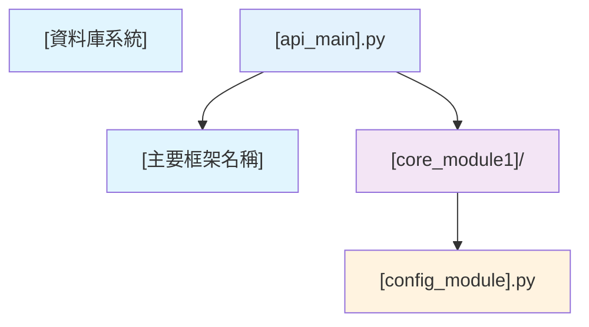

# 檔案相依關係文檔 (File Dependencies Document) - [專案名稱]

---

**文件版本 (Document Version):** `v1.0`

**最後更新 (Last Updated):** `YYYY-MM-DD`

**主要作者 (Lead Author):** `[請填寫]`

**審核者 (Reviewers):** `[列出主要審核人員/團隊]`

**狀態 (Status):** `[例如：草稿 (Draft), 審核中 (In Review), 已批准 (Approved)]`

---

## 目錄 (Table of Contents)

1.  [概述 (Overview)](#1-概述-overview)
2.  [整體架構依賴關係 (Overall Architecture Dependencies)](#2-整體架構依賴關係-overall-architecture-dependencies)
3.  [層級結構分析 (Layer Structure Analysis)](#3-層級結構分析-layer-structure-analysis)
4.  [具體 Import 關係 (Specific Import Relationships)](#4-具體-import-關係-specific-import-relationships)
5.  [循環依賴檢查 (Circular Dependency Check)](#5-循環依賴檢查-circular-dependency-check)
6.  [部署依賴順序 (Deployment Dependency Order)](#6-部署依賴順序-deployment-dependency-order)
7.  [開發依賴影響 (Development Dependency Impact)](#7-開發依賴影響-development-dependency-impact)

---

## 1. 概述 (Overview)

### 1.1 文檔目的 (Document Purpose)
*   `[描述本文檔的主要目的，例如：使用 Mermaid 圖表描述 [專案名稱] 中檔案之間的相依關係，包括模組導入、組件依賴和層級結構。]`

### 1.2 依賴分析範圍 (Dependency Analysis Scope)
*   **分析層級**: `[例如：檔案級、模組級、套件級]`
*   **包含範圍**: `[例如：內部依賴、外部套件、系統依賴]`
*   **排除項目**: `[例如：標準庫、測試檔案、工具腳本]`

---

## 2. 整體架構依賴關係 (Overall Architecture Dependencies)

### 2.1 高層級依賴圖 (High-Level Dependency Diagram)



### 2.2 外部依賴清單 (External Dependencies List)

| 外部依賴 | 版本要求 | 用途說明 |
|----------|----------|----------|
| `[framework_name]` | `[version_constraint]` | `[主要用途描述]` |
| `[database_lib]` | `[version_constraint]` | `[用途描述]` |

---

## 3. 層級結構分析 (Layer Structure Analysis)

### 3.1 層級架構說明 (Layer Architecture Description)

#### **Layer 0: [外部依賴層] (External Dependencies Layer)**
*   **[external_framework]**: `[框架用途說明]`

#### **Layer 1: [配置基礎層] (Configuration Foundation Layer)**
*   **[config_component]**: `[配置管理說明]`

---

## 4. 具體 Import 關係 (Specific Import Relationships)

### 4.1 [核心模組] Import 關係

#### `[module_path]/[file1].py`
```python
# 依賴關係註解
import [standard_library]                    # ← 標準庫
from [external_package] import [class]       # ← 外部套件
from [internal_module] import [component]    # ← 內部模組
```

---

## 5. 循環依賴檢查 (Circular Dependency Check)

### 5.1 循環依賴檢測結果 (Circular Dependency Detection Results)

#### ✅ 無循環依賴 (No Circular Dependencies)
*   所有組件遵循 `[依賴原則，例如：單向依賴原則]`
*   依賴關係形成有向無環圖 (DAG)

### 5.2 依賴隔離設計 (Dependency Isolation Design)

1. **[隔離類型1]**: `[例如：配置隔離 - 所有配置集中在 config.py]`
2. **[隔離類型2]**: `[例如：數據隔離 - 數據結構獨立在 models.py]`

---

## 6. 部署依賴順序 (Deployment Dependency Order)

### 6.1 服務啟動順序 (Service Startup Order)

```
1. [基礎服務1] ([dependency description])
2. [應用程式] (depends on all above)
```

---

## 7. 開發依賴影響 (Development Dependency Impact)

### 7.1 修改影響範圍分析 (Change Impact Analysis)

| 修改檔案 | 直接影響 | 間接影響 | 重新測試範圍 |
|----------|----------|----------|--------------|
| `[core_file].py` | `[直接受影響的檔案]` | `[間接受影響的檔案]` | `[需要重新測試的範圍]` |

---

## 📝 使用指南 (Usage Guide)

### 如何使用此模板 (How to Use This Template)
1. **複製模板**: 將此檔案複製並重新命名為 `02_file_dependencies.md`
2. **填寫基本資訊**: 更新文檔頭部的版本、日期、作者等資訊
3. **替換佔位符**: 將所有 `[...]` 佔位符替換為專案實際內容
4. **繪製依賴圖**: 使用 Mermaid 繪製實際的依賴關係圖

---
**文件審核記錄 (Review History):**

| 日期       | 審核人     | 版本 | 變更摘要 |
| :--------- | :--------- | :--- | :------- |
| YYYY-MM-DD | [姓名/團隊] | v1.0 | 初稿提交 |
